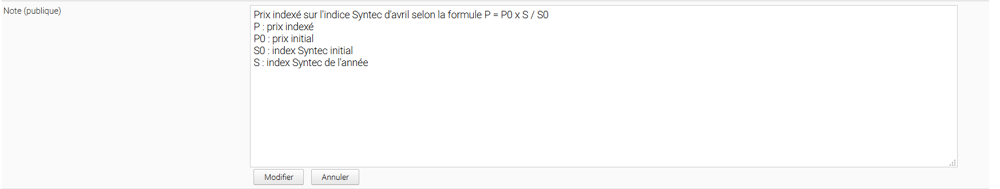
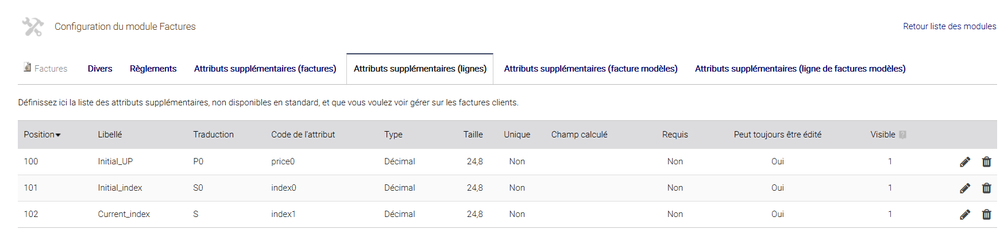
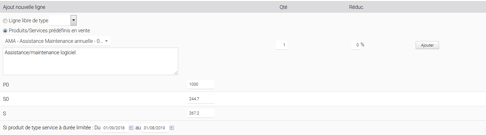
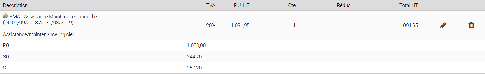
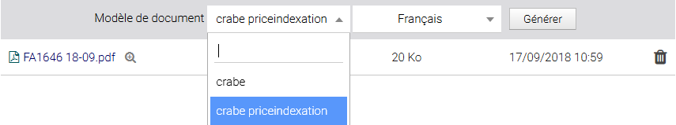
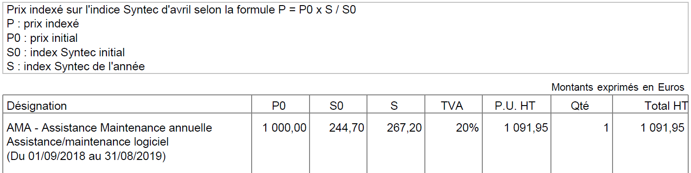

# PRICE INDEXATION FOR DOLIBARR ERP CRM

## Features
Give the ability to automatically calculate the indexed unit price of a product line in Propal/Bill from initial price, initial index and current index stored in extrafields.

The new indexed unit price is calculated with the following formula :

*unit price = price0 x index1 / index0*

Probably, you'll need add this information in public note of propal/invoices

This module need 3 extrafields by Propal/Bill line :
- Initial price : price0
- Initial index : index0
- Current index : index1

**It creates them if they don't exist.**

Two PDF models are provided for :
-  proposals (*azur priceindexation*) and,
-  invoices (*crabe indexation*)

### Translations

Translations can be defined manually by editing files into directories *langs*.

To change columns names for *price0*, *index0* and *index1*, you have to edit concerned *.lang* file and modifiy :

- Text associated to *Initial_UP* to change *price0* label
- Text associated to *Initial_index* to change *index0* label
- Text associated to *Current_index* to change *index1* label

**NB :** *never change the text which is before "=" sign. It's the unique key of translatable text*

Today, this module is available in following languages
- en_US
- fr_FR

Install
-------

### Manually

- Make sure Dolibarr is already installed and configured on your workstation or development server.

- send all the files of the module to htdocs/custom/

### Final steps

From your browser:

  - Log into Dolibarr as a super-administrator
  - Go to "Setup" -> "Modules"
  - You should now be able to find and enable the module

### Usage

* Input values (initial price, initial index and current index)

* You get

  
* Choose *azur priceindexation* model (proposal) or *crabe priceindexation* model (invoice)

  
* Generate PDF

  

Licenses
--------

### Main code

GPLv3 or any later version.

See [COPYING](COPYING) for more information.

#### Documentation

All texts and readmes.

